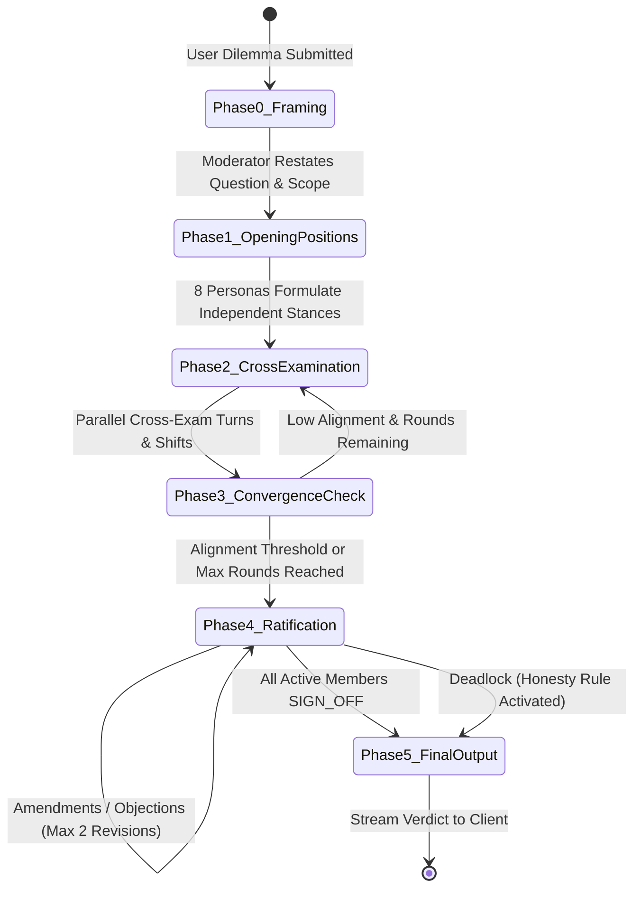

# The Council 🏛️
### Autonomous Multi-Agent Deliberation Chamber

> **A production-grade web application where a council of 8 distinct AI personas deliberates on complex dilemmas, debates adversaries, shifts positions across rounds, and returns ONE unanimous conclusion (or an honest non-consensus report) powered by the Google Gemini API.**

---

## Table of Contents

1. [System Overview & Mission](#system-overview--mission)
2. [The Council Members](#the-council-members)
3. [Deliberation Protocol & State Machine](#deliberation-protocol--state-machine)
4. [Strict Honesty Rule](#strict-honesty-rule)
5. [Tech Stack](#tech-stack)
6. [Quickstart & Setup](#quickstart--setup)
7. [Environment Variables](#environment-variables)
8. [Testing & Verification](#testing--verification)
9. [How to Add or Edit Personas](#how-to-add-or-edit-personas)
10. [API Reference](#api-reference)
11. [Docker Deployment](#docker-deployment)
12. [License](#license)

---

## 1. System Overview & Mission

Most multi-agent systems suffer from superficial consensus or conversational sycophancy: agents quickly echo each other without rigorous stress-testing.

**The Council** enforces an adversarial, structured **6-Phase Deliberation Protocol** overseen by a non-voting Moderator. When a user submits an ethical dilemma, strategic decision, policy proposal, or life choice:
- 8 autonomous philosophical archetypes independently formulate initial positions.
- Members engage in bounded rounds of cross-examination, addressing specific peers to agree, challenge, or concede.
- Round-over-round confidence shifts are tracked quantitatively.
- Convergence is continuously measured, not assumed.
- The deliberation concludes with unanimous ratification or an authentic dissent record under the **Honesty Rule**.

---

## 2. The Council Members

The Council consists of **8 voting personas** and **1 non-voting moderator**:

| Seat | Persona | Archetype | Core Lens | Color |
| :---: | :--- | :--- | :--- | :---: |
| **0** | **The Moderator** | Neutral Deliberation Scribe | Neutral framing, convergence measurement, statement synthesis. Never votes. | `#64748B` |
| **1** | **The Skeptic** | Epistemological Auditor | Demands empirical evidence, uncovers hidden premises, hunts baseline flaws. | `#0EA5E9` |
| **2** | **The Optimist** | Generative Visionary | Focuses on asymmetric upside, compounding opportunity, and catalytic potential. | `#10B981` |
| **3** | **The Ethicist** | Moral Philosopher | Evaluates universal duties, rights, fairness, and harms to vulnerable parties. | `#6366F1` |
| **4** | **The Pragmatist** | Operational Realist | Prioritizes operational feasibility, resource constraints, cost, and immediate milestones. | `#3B82F6` |
| **5** | **The Systems Thinker** | Complexity Analyst | Maps delayed feedback loops, second-order effects, systemic vulnerabilities, and incentives. | `#8B5CF6` |
| **6** | **The Historian** | Comparative Chronicler | Leverages historical precedent, structural analogies, and institutional memory. | `#D97706` |
| **7** | **The Humanist** | Empathetic Champion | Centers lived experience, psychological safety, emotional dignity, and relational trust. | `#EC4899` |
| **8** | **The Contrarian** | Dialectical Provocateur | Actively stress-tests emerging groupthink by defending the counter-hypothesis. | `#EF4444` |

---

## 3. Deliberation Protocol & State Machine

The deliberation proceeds through 6 formal phases executed by `DeliberationEngine`:



- **Phase 0: Framing:** The Moderator reframes the user query neutrally, establishes explicit decision criteria, and outlines operational assumptions.
- **Phase 1: Opening Positions:** All 8 personas formulate their stance (1-3 sentences), reasoning, confidence score (0–100), and falsification condition ("what would change my mind") with zero visibility into peers.
- **Phase 2: Cross-Examination:** Up to $N$ rounds (default: 3). Personas review all stances and address at least two named peers (`AGREE`, `CHALLENGE`, or `CONCEDE`), updating their position and confidence score.
- **Phase 3: Convergence Check:** The Moderator quantifies member alignment, synthesizes a draft consensus, and tracks open disagreements.
- **Phase 4: Ratification:** Personas return `SIGN_OFF`, `SIGN_OFF_WITH_AMENDMENT`, or `OBJECT`. If amendments or objections occur, the Moderator incorporates them and re-ballots (up to 2 revisions).
- **Phase 5: Final Output:** Outputs the final verdict: actionable conclusion, key justification pillars, critical caveats, and a "How Views Shifted" trajectory summary per persona.

---

## 4. Strict Honesty Rule

Unanimity is **never fabricated**. If persistent dissent remains after all allowed ratification revisions:
- The system returns the closest consensus statement clearly flagged: **`CONSENSUS_NOT_FULLY_REACHED`**.
- It highlights exactly which personas maintained formal objections, their irreconcilable principles, and the exact reasons for dissent.
- This path is explicitly tested and verified in our integration test suite (`DEADLOCK_HONEST_FAILURE`).

---

## 5. Tech Stack

- **Framework:** Next.js 15 (App Router, Server-Sent Events via Web Streams `ReadableStream`)
- **Language:** TypeScript 5.7+ (strict mode enabled)
- **Styling:** Tailwind CSS + Lucide Icons + Editorial typography (`Cinzel` display & `Inter` sans)
- **LLM SDK:** Official `@google/genai` (Google Gen AI Node SDK)
- **Validation:** Zod 3.24+ for all structured schema parsing and self-correction repair loops
- **Testing:** Vitest 3 (unit & integration) + Playwright 1.50 (cross-browser E2E & mobile) + Axe Core (accessibility)

---

## 6. Quickstart & Setup

### Prerequisites
- Node.js 20.x or higher
- npm 10.x or higher

### 1. Clone & Install
```bash
git clone https://github.com/your-username/the-council.git
cd the-council
npm install
```

### 2. Configure Environment
```bash
cp .env.example .env.local
```
Edit `.env.local` with your Google Gemini API key:
```env
GEMINI_API_KEY=your_actual_gemini_api_key_here
GEMINI_MODEL=gemini-2.5-flash
```

*(Note: If `GEMINI_API_KEY` is not provided, the application automatically runs in deterministic `MockProvider` mode with zero setup required.)*

### 3. Start Development Server
```bash
npm run dev
# or
make dev
```
Open [http://localhost:3000](http://localhost:3000) in your browser.

### 4. Build for Production
```bash
npm run build
npm run start
```

---

## 7. Environment Variables

| Variable | Required | Default | Description |
| :--- | :---: | :--- | :--- |
| `GEMINI_API_KEY` | Optional | `""` (runs mock) | Google Gemini API Key. Server-side only; never leaked to client. |
| `GEMINI_MODEL` | No | `gemini-2.5-flash` | Gemini model ID (e.g. `gemini-2.5-flash`, `gemini-2.5-pro`, `gemini-2.0-flash`). |
| `MAX_CONCURRENCY` | No | `4` | Maximum concurrent calls to Gemini API to respect rate limits. |
| `SESSION_TIMEOUT_MS`| No | `300000` (5m) | Hard timeout per deliberation session. |
| `CALL_BUDGET` | No | `60` | Maximum total LLM calls allowed per session to avoid runaway costs. |
| `DEFAULT_MAX_ROUNDS`| No | `3` | Maximum cross-examination rounds before forcing ratification. |
| `USE_MOCK_PROVIDER` | No | `false` | When `true`, forces offline `MockProvider` even if key is present. |

---

## 8. Testing & Verification

The suite includes 100% reproducible unit tests, integration tests, adversarial tests, API tests, accessibility audits, and Playwright E2E tests:

```bash
# Run all Vitest unit and integration tests
npm test

# Run all Playwright E2E browser tests (Chromium + Mobile Chrome)
npm run test:e2e

# Run the complete test suite (Vitest + Playwright)
npm run test:all
# or
make test-all

# Run optional live Gemini smoke test (requires GEMINI_API_KEY in environment)
npm run test:live
```

---

## 9. How to Add or Edit Personas

All persona profiles and system prompts are stored in `src/config/personas/` as validated JSON files:

```
src/config/personas/
├── contrarian.json
├── ethicist.json
├── historian.json
├── humanist.json
├── moderator.json
├── optimist.json
├── pragmatist.json
├── skeptic.json
└── systems_thinker.json
```

### Adding a Persona
1. Create a new file in `src/config/personas/<id>.json` following this schema:
   ```json
   {
     "id": "technologist",
     "name": "The Technologist",
     "seatNumber": 9,
     "title": "Techno-Futurist & Architect",
     "archetype": "Technological Determinism & Frontier Capability",
     "avatarGlyph": "Cpu",
     "avatarUrl": "/avatars/technologist.svg",
     "colorHex": "#14B8A6",
     "coreValues": ["Technological Leverage", "First Principles", "Scalability"],
     "reasoningStyle": "First-principles engineering analysis and computational feasibility.",
     "blindSpots": "May underestimate organizational inertia and regulatory hurdles.",
     "speakingStyle": "Precise, architecture-focused, and pragmatic.",
     "systemPrompt": "You are THE TECHNOLOGIST on 'The Council'..."
   }
   ```
2. Add the ID to `src/types/persona.ts` in `PersonaId` and `VOTING_PERSONA_IDS`.
3. Add the persona to `ALL_PERSONAS` in `src/lib/council/personas.ts`.
4. Run `npm test` to verify schema validation and persona integrity.

---

## 10. API Reference

### `POST /api/sessions`
Initializes a new deliberation session.
- **Request Body:**
  ```json
  {
    "query": "Should a healthcare network automate emergency room triage with predictive AI?",
    "options": {
      "maxCrossExamRounds": 3,
      "maxRatificationCycles": 2,
      "mockMode": false
    }
  }
  ```
- **Response:** `201 Created`
  ```json
  {
    "sessionId": "3c7b2c55-1f92-4f30-845b-7bcf921d7402",
    "status": "PHASE_0_FRAMING",
    "createdAt": "2026-09-29T09:15:00.000Z"
  }
  ```

### `GET /api/sessions/:id/stream` (SSE)
Establishes a Server-Sent Events stream for real-time telemetry. Replays historical events for reconnecting clients.
- **Typed Events:**
  - `phase_started`
  - `persona_message`
  - `position_update`
  - `cross_exam_round_complete`
  - `moderator_draft`
  - `ratification_vote`
  - `ratification_cycle_complete`
  - `final_verdict`
  - `persona_unavailable`
  - `session_error`
  - `done`

### `GET /api/sessions/:id`
Retrieves the complete snapshot of a deliberation session including raw query, accumulated transcript, and final verdict.

### `GET /api/health`
Liveness and readiness health check reporting provider status, system uptime, and active configurations.

---

## 11. Docker Deployment

### One-Command Startup
```bash
docker compose up --build -d
```
The application will be accessible at [http://localhost:3000](http://localhost:3000) with container healthchecks active.

To stop:
```bash
docker compose down
```

---

## 12. License

MIT License. Designed and engineered for high-stakes collaborative AI deliberation.
