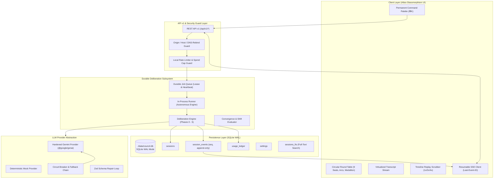

# The Council: Target Architecture v2 (Local-First & Production-Grade) (`docs/ARCHITECTURE_V2.md`)

> **Version:** 2.0.0  
> **Status:** Architecture Standard  
> **Execution Environment:** Localhost (Node.js LTS, Next.js 15 App Router, React 19, SQLite WAL)

---

## 1. Executive Summary & Architectural Shifts

Version 2.0 re-architects The Council from an ephemeral in-memory prototype into a durable, local-first daily-driver application. It decouples the multi-agent deliberation engine from transient HTTP connections and introduces an event-sourced persistence layer backed by SQLite.



---

## 2. Decoupled Deliberation Lifecycle & Event Sourcing

### 2.1 The HTTP-Decoupled Pattern
In prototype systems, an SSE stream is directly coupled to an in-flight LLM execution. If the user closes the browser tab, refreshes, or if the laptop sleeps, the HTTP socket terminates and the deliberation either crashes or becomes orphaned.

In Architecture v2:
1. `POST /api/v1/sessions` validates inputs, writes a durable session record to `sessions`, enqueues a job record, and returns HTTP 201 `{ sessionId, status: 'QUEUED' }` within ~10ms.
2. The **Durable Runner** (an in-process background worker with periodic polling, lease acquisition, and heartbeat renewal) picks up the queued session.
3. Every state change and persona utterance is committed to the append-only `session_events` table with a strictly monotonic sequence number: `(session_id, seq)`.
4. `GET /api/v1/sessions/:id/stream` provides **Resumable SSE**:
   - Accepts `Last-Event-ID` header or `?after=seq` query parameter.
   - Immediately queries `session_events` for any events where `seq > lastSeq` and streams them to the client.
   - Attaches a live subscriber to receive future events in real time.
   - Sends periodic SSE comments (`: ping\n\n`) every 15s to keep the connection alive.
   - If the tab is closed and reopened at any point, the client passes its highest observed `seq` and resumes with zero duplicate or missing events.

### 2.2 App Restart & Crash Recovery
When the server starts:
- The runner scans `sessions` for any session in an active running state whose worker lease has expired (`last_heartbeat < now - lease_timeout`).
- Interrupted sessions are marked `INTERRUPTED` with their last committed event preserved.
- The UI displays a clean "Resume Deliberation" action, allowing the engine to hydrate from the last committed phase and continue to completion.

---

## 3. Local SQLite Persistence Schema

Database file: `./data/council.db` with PRAGMAs:
```sql
PRAGMA journal_mode = WAL;
PRAGMA synchronous = NORMAL;
PRAGMA foreign_keys = ON;
PRAGMA busy_timeout = 5000;
```

### 3.1 Tables

```sql
-- 1. Sessions Table
CREATE TABLE IF NOT EXISTS sessions (
  id TEXT PRIMARY KEY,
  title TEXT NOT NULL,
  query TEXT NOT NULL,
  options JSON NOT NULL,
  status TEXT NOT NULL, -- QUEUED, RUNNING, COMPLETED, FAILED, CANCELLED, INTERRUPTED
  current_phase TEXT NOT NULL,
  verdict_type TEXT,    -- UNANIMOUS_CONSENSUS, CONSENSUS_NOT_FULLY_REACHED, FAILED, CANCELLED
  verdict_payload JSON,
  model_used TEXT NOT NULL,
  call_count INTEGER DEFAULT 0,
  prompt_tokens INTEGER DEFAULT 0,
  candidate_tokens INTEGER DEFAULT 0,
  cost_estimate_usd REAL DEFAULT 0.0,
  pinned INTEGER DEFAULT 0,
  tags TEXT,
  worker_id TEXT,
  lease_expires_at INTEGER,
  created_at INTEGER NOT NULL,
  started_at INTEGER,
  finished_at INTEGER,
  deleted_at INTEGER
);

-- 2. Append-Only Session Events Table
CREATE TABLE IF NOT EXISTS session_events (
  id INTEGER PRIMARY KEY AUTOINCREMENT,
  session_id TEXT NOT NULL REFERENCES sessions(id) ON DELETE CASCADE,
  seq INTEGER NOT NULL,
  event_type TEXT NOT NULL,
  payload JSON NOT NULL,
  created_at INTEGER NOT NULL,
  UNIQUE(session_id, seq)
);

CREATE INDEX IF NOT EXISTS idx_events_session_seq ON session_events(session_id, seq);

-- 3. Idempotency Keys Table
CREATE TABLE IF NOT EXISTS idempotency_keys (
  key TEXT PRIMARY KEY,
  session_id TEXT NOT NULL REFERENCES sessions(id) ON DELETE CASCADE,
  created_at INTEGER NOT NULL
);

-- 4. Settings Table (Key/Value)
CREATE TABLE IF NOT EXISTS settings (
  key TEXT PRIMARY KEY,
  value JSON NOT NULL,
  updated_at INTEGER NOT NULL
);

-- 5. Personal Usage Ledger
CREATE TABLE IF NOT EXISTS usage_ledger (
  id INTEGER PRIMARY KEY AUTOINCREMENT,
  session_id TEXT REFERENCES sessions(id) ON DELETE SET NULL,
  model_id TEXT NOT NULL,
  prompt_tokens INTEGER NOT NULL,
  candidate_tokens INTEGER NOT NULL,
  estimated_cost_usd REAL NOT NULL,
  timestamp INTEGER NOT NULL
);

-- 6. Full-Text Search (FTS5) for History
CREATE VIRTUAL TABLE IF NOT EXISTS sessions_fts USING fts5(
  session_id UNINDEXED,
  title,
  query,
  verdict_conclusion,
  content=''
);
```

---

## 4. API v1 Specification

All API v1 routes return a standardized response envelope:

```typescript
// Standard Success Response
{
  "data": { ... },
  "meta": {
    "requestId": "req_...",
    "timestamp": 1727788800000
  }
}

// Standard Error Response
{
  "error": {
    "code": "BAD_REQUEST" | "NOT_FOUND" | "SPEND_CAP_EXCEEDED" | "RATE_LIMITED" | "INTERNAL_ERROR",
    "message": "Human-readable explanation",
    "requestId": "req_...",
    "details": { ... }
  }
}
```

### Route Index
- `POST   /api/v1/sessions` — Create and enqueue deliberation session (supports `Idempotency-Key`).
- `GET    /api/v1/sessions` — Paginated history with FTS search (`?q=...&limit=20&cursor=...`).
- `GET    /api/v1/sessions/:id` — Retrieve session state, metadata, and verdict.
- `PATCH  /api/v1/sessions/:id` — Update session (pin, rename title, tags).
- `DELETE /api/v1/sessions/:id` — Soft-delete session.
- `GET    /api/v1/sessions/:id/stream` — Resumable SSE endpoint (`Last-Event-ID`).
- `POST   /api/v1/sessions/:id/cancel` — Gracefully stop execution mid-run.
- `POST   /api/v1/sessions/:id/rerun` — Clone and re-enqueue session with identical or altered options.
- `GET    /api/v1/sessions/:id/export` — Export deliberation as Markdown, JSON, or printable document.
- `GET    /api/v1/settings` — Retrieve current local settings.
- `PATCH  /api/v1/settings` — Update settings (default model, spend caps, rounds, LAN opt-in).
- `POST   /api/v1/settings/test-key` — Test Gemini API key validity without saving or leaking it.
- `GET    /api/v1/usage` — Usage ledger and monthly spend totals against user-configured cap.
- `GET    /api/health/live` — Liveness probe (process running).
- `GET    /api/health/ready` — Readiness probe (SQLite connected, DB migrations applied, runner active).

---

## 5. Round Table Hero Component Architecture

The Council's signature interface is a circular round table seating 9 members.

### Geometry Math (`computeSeatLayout`)
For $N$ voting members plus 1 Moderator:
- Total seats: $S = N + 1$ (e.g. $8 + 1 = 9$).
- Head seat (Moderator): Angle $\theta_0 = 0^\circ$ (top / 12 o'clock).
- Remaining $N$ seats: Positioned clockwise at equal intervals $\Delta\theta = \frac{360^\circ}{S} = 40^\circ$.
- Coordinates on table radius $R$ around center $(C_x, C_y)$:
  $$X_i = C_x + R \cdot \sin(\theta_i)$$
  $$Y_i = C_y - R \cdot \cos(\theta_i)$$

### Dynamic Stance Arcs
Cross-examination interactions are rendered as SVG Bezier curves from speaker coordinates $(X_s, Y_s)$ to peer coordinates $(X_p, Y_p)$ curving through a control point toward the table center $(C_x, C_y)$:
$$C_p = (C_x + \alpha \cdot (X_m - C_x), C_y + \alpha \cdot (Y_m - C_y))$$
where $(X_m, Y_m)$ is the midpoint and $\alpha \in [0.2, 0.4]$ is the curvature factor.

- `AGREE`: Solid line in speaker's persona color.
- `CHALLENGE`: Dashed line in speaker's persona color.
- `CONCEDE`: Dotted line in speaker's persona color.
- Arcs auto-fade after 4.5 seconds or persist on seat hover/selection.
